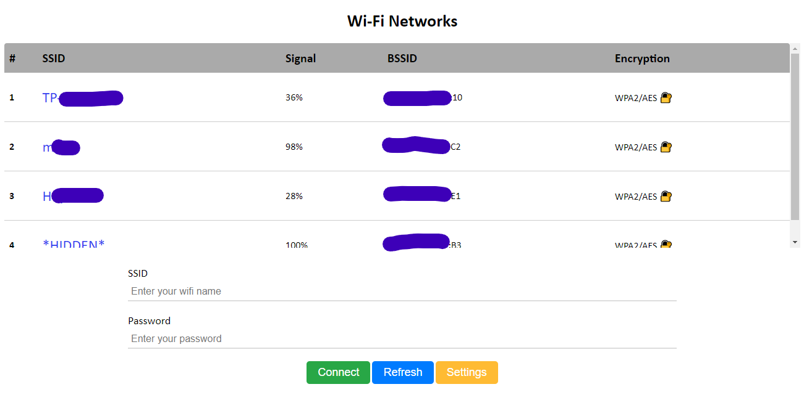

# Config Wi-Fi Connection Captive Portal

This project is used to configure your Wi-Fi network connection. Using this project, you can search for WLAN networks and easily connect to the required network, and after rebooting the module, if there is a previous network, it will connect to that network.

## Features
- Captive Portal
- Save Wi-Fi config
- Automatic connection after network configuration 
- Search Wi-Fi networks
- User Friendly
- And more...

  

## Usage
1. Upload the project on ESP8266
2. Captive portal access point automatically starts after the first run
3. Connect to this AP\
By default: 
*SSID:* `Captive-Portal` and *password:* `11111111`
4. The network configuration page opens automatically after connection (if it does not open in your browser, enter `172.217.28.1` IP in the browser)

## Config
If you need to configure and change the behavior of the project, go to the `config.h` file

- `UNIQUE_PASSWORD`: If it is set true a unique password will be created with the Chip ID module (*default: `false`*)
- `MAX_CONNECTION`: The number of devices that can connect to the access point in network configuration mode (*default: `1`*)
- `APIP`: Access Point IP (*default: `172.217.28.1`*)
- `HOSTNAME`: The name of the device connected to the network (*default: `CP-Device`*)
- `DNS_PORT`:  DNS Server Port (*default: `53`*)

### Edit Web Interface
1. After changing the front-end code, use the `converter.py` script to convert the front-end files to gzip files to compress the file.
2. After running the `converter.py` script, a directory called output is created in the given directory
3. Now you can replace the content of the `webfiles.h` file in the output directory with the content of the `webfiles.h` file in the project

Dear fellow developers,
If you have found our project to be useful, we kindly request that you show your support by starring it on GitHub.

Best regards
[Kian]